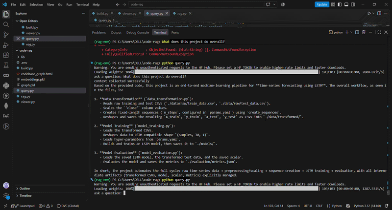
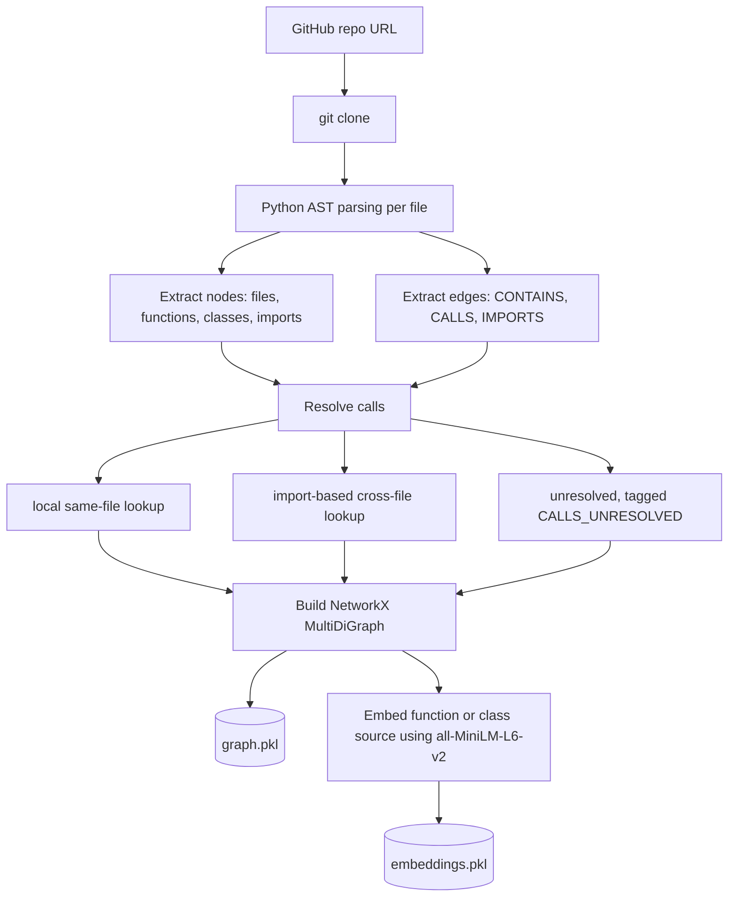

# repograph

**AST-based codebase structure extraction + hybrid semantic/graph retrieval (GraphRAG) for Python repositories.**

Point it at a GitHub repo. It parses every Python file into an AST, extracts functions, classes, and call relationships into a graph, embeds each function/class as a semantic chunk, and answers natural-language questions about the codebase by combining vector similarity search with graph traversal (callers/callees) — not just text matching.

---

## Demo



Example queries run against [AAPL-stock-prediction-model](https://github.com/KhushiKeswani/AAPL-stock-prediction-model):

> **Q: How is the data cleaned before training?**
>
> The explicit data cleaning occurs in the `preprocess_data` function within `src/components/data_ingestion.py`. The steps are: converting the `date` column to datetime format, and removing rows with missing values via `dropna()`. [...] The `data_transformation.py` module later performs scaling and sequence creation, but those are feature engineering steps rather than "cleaning."

> **Q: Walk me through what happens from raw data to a trained model.**
>
> Traces the full pipeline across files: `load_data` → `preprocess_data` → `save_preprocessed_data` (`data_ingestion.py`), then `scaling_data` → `create_sequences` → `save_data` (`data_transformation.py`), then `build_model` → `save_model` (`model_training.py`).

---

## How it works

### Build time



### Query time

```
User question
      |
      v
Embed question
      |
      v
Cosine similarity vs. stored chunk embeddings
      |
      v
Top-k semantic matches (seed nodes)
      |
      v
Graph traversal: in_edges / out_edges on CALLS
      |
      v
Pull in callers and callees of each seed
      |
      v
Combined, deduplicated, file/function-labeled context
      |
      v
LLM (via OpenRouter) generates grounded answer
```

This is what distinguishes it from plain RAG: semantic search alone finds text that *sounds* relevant, but has no notion of "this function calls that function." The graph traversal step adds structural relationships extracted directly from the AST — not guessed from text similarity.

---

## Project structure

```
repograph/
├── build.py          # clone repo, parse AST, build graph, embed chunks, save to disk
├── viewer.py         # load graph.pkl, interactive PyVis visualization (click-to-highlight)
├── query.py          # load graph.pkl + embeddings.pkl, answer natural-language questions
├── requirements.txt
├── .env.example
└── demo.gif
```

---

## Setup

```bash
pip install -r requirements.txt
```

Copy `.env.example` to `.env` and add your [OpenRouter](https://openrouter.ai) API key:

```
OPENROUTER_API_KEY=your_key_here
```

---

## Usage

**1. Build the graph** (run once per repo — clones, parses, embeds, saves to disk)

```bash
python build.py
# prompts for a GitHub repo URL
```

**2. Ask questions**

```bash
python query.py
# ask a question: How is the data cleaned before training?
```

**3. Visualize the structure**

```bash
python viewer.py
# select a file to see its functions/classes and call relationships
# interactive: click a node to highlight its connections
```

---

## What it does well

- Correctly extracts functions, classes, and imports from any Python file via `ast`
- Resolves function calls to the exact node they refer to — including when multiple files define same-named functions (e.g. three separate `load_params` in three files stay correctly disambiguated by file path)
- Distinguishes local calls, import-resolved cross-file calls, and unresolved/external calls (e.g. calls into third-party libraries) rather than guessing
- Combines semantic retrieval with graph-based caller/callee expansion, giving the LLM structurally-grounded context instead of isolated text chunks
- Interactive graph visualization with click-to-highlight, built on a real hierarchical layout

---

## Known limitations

- **Cross-file resolution** depends on explicit `import` statements being present; it does not do deeper module/package resolution.
- **Config and doc files** (`.yaml`, `.json`, `README.md`) are detected but not yet parsed, chunked, or embedded — the retrieval layer currently only reasons over Python function/class content.
- **No formal retrieval evaluation** exists yet. Testing so far has been manual: a set of ground-truth questions (e.g. "what calls `load_params`?") checked by hand against the known graph structure. A next step would be a small benchmark set of (query, expected function) pairs to measure precision@k.
- **Single language** — the graph schema (nodes/edges) is language-agnostic, but extraction is Python-only (`ast`). Multi-language support would need a parser like tree-sitter per language.
- **Local only** — runs as a CLI on your machine; no hosted/packaged distribution yet.

---

## Roadmap

- [ ] Resolve `ast.Attribute` calls (method calls, module-qualified calls)
- [ ] Embed config/doc files as additional semantic chunks
- [ ] Precision@k evaluation against a hand-labeled query set
- [ ] Package as an installable CLI (`pip install`, proper entry point)
- [ ] Impact analysis ("what breaks if I change X") as a first-class query type

---

## Built with

Python `ast` · NetworkX · PyVis · sentence-transformers (`all-MiniLM-L6-v2`) · OpenRouter API
